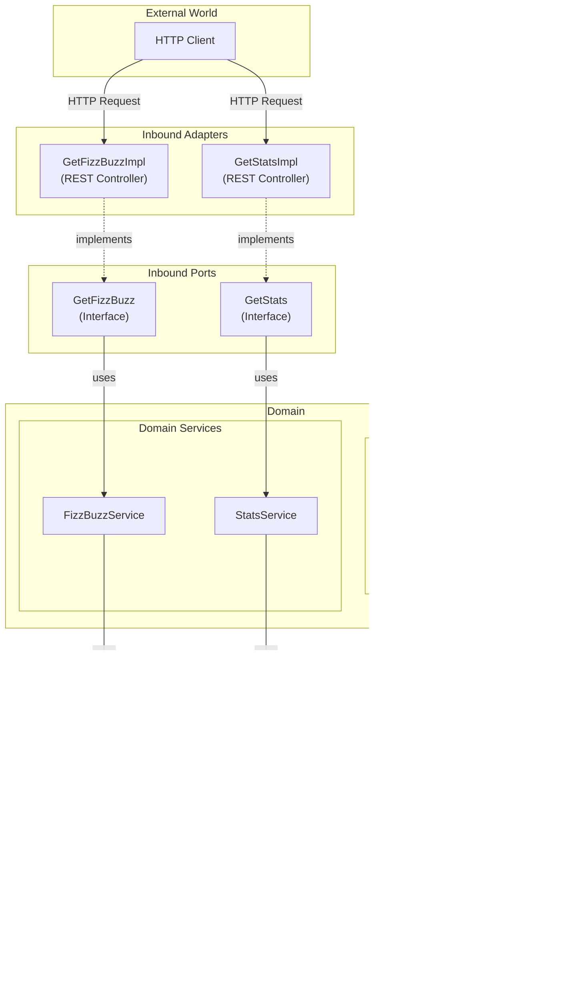

# Fizz-buzz exercise

## Architecture

The service has been architected in a Hexagonal pattern or Ports and Adapters pattern. This allows for a clean
separation of concerns and makes it easy to swap out different components of the system without affecting the core
logic and also a nice way to test separate modules easily.

